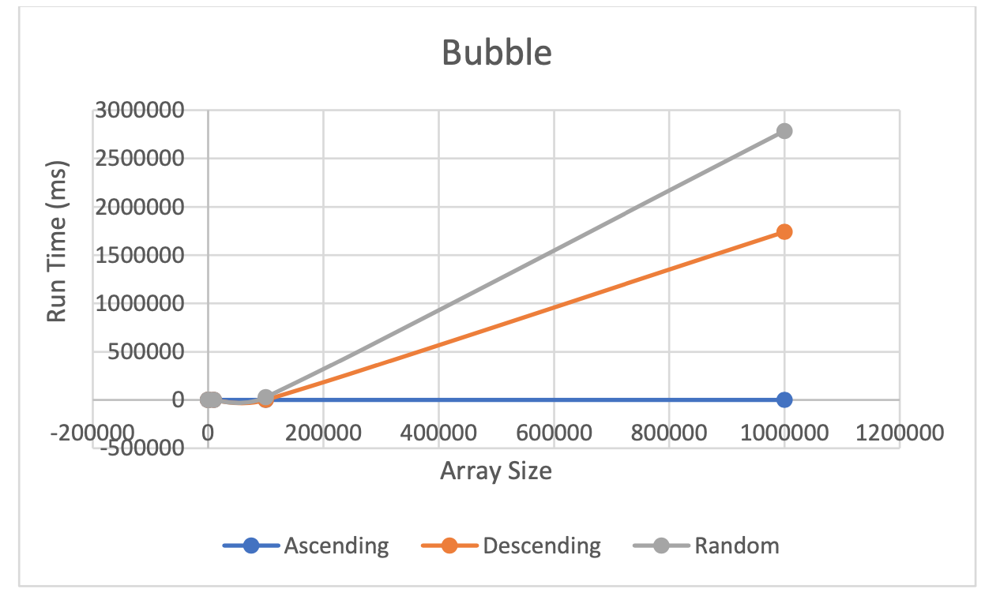
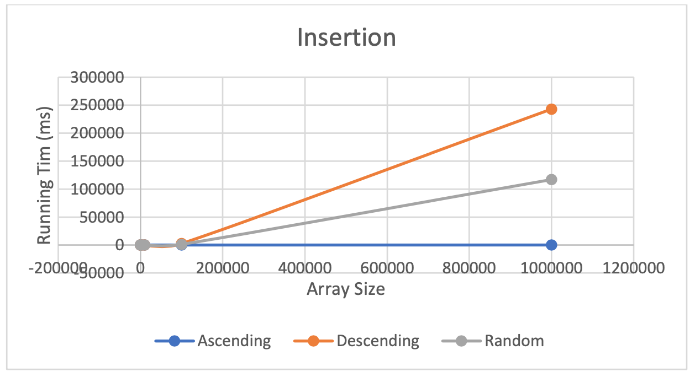
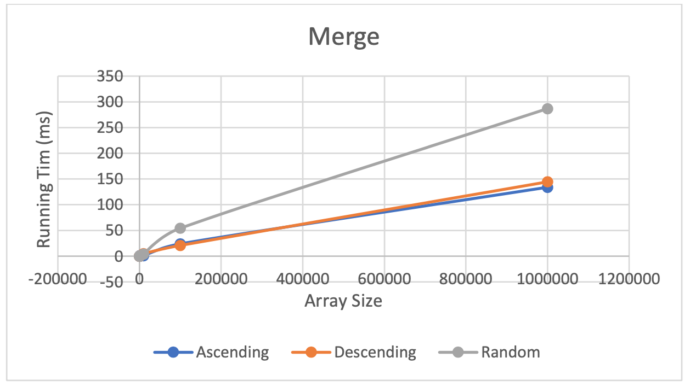
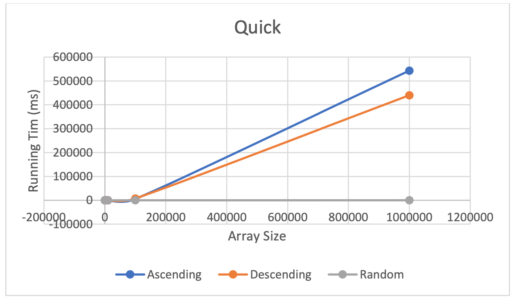
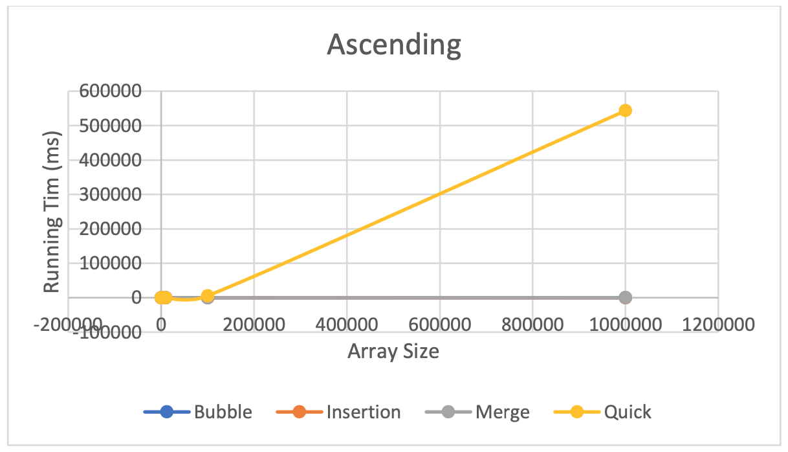
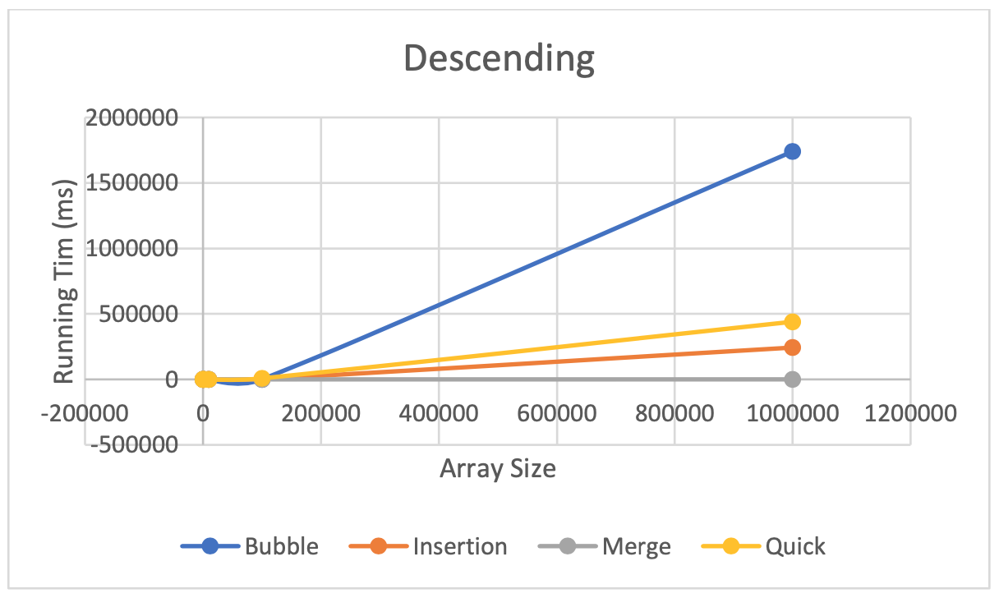
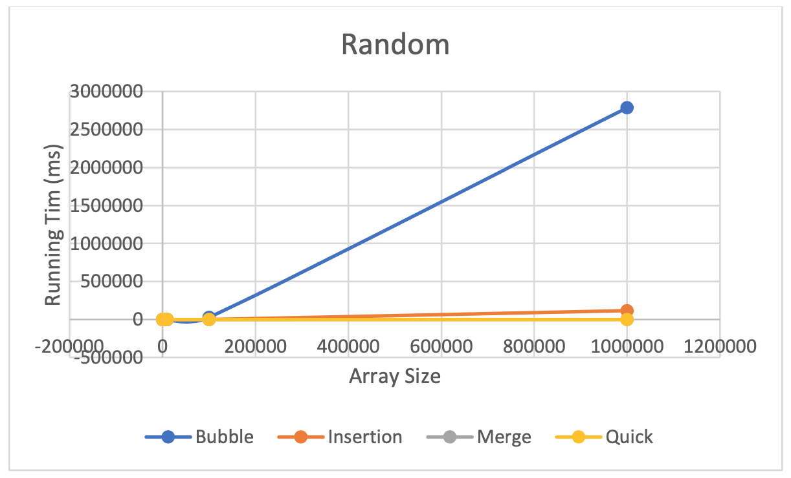
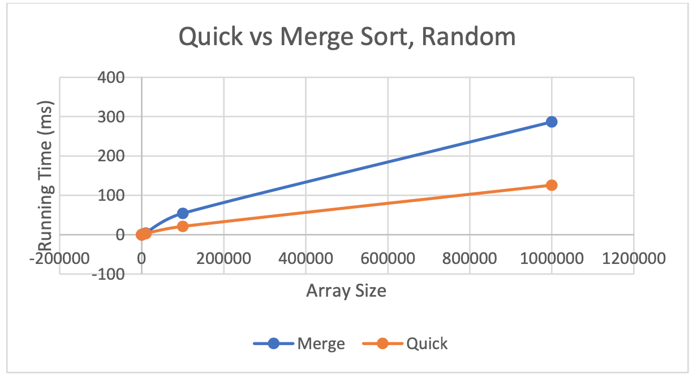

# Data-Structures-Project

## Introduction

This project was one of the first introductions I had to data structures and algorithms. The goal was to teach me how different sorting algorithms can be implemented and how their time complexity is affected by one's design. It also taught me how we can make our own data structures like linked lists and how these structures can be used for various purposes.

The project is divided into two Exercises. Exercise 1 demonstrates the time complexity of sorting algorithms, and Exercise 2 demonstrates the utility of Linked Lists.

## Exercise 1

### How to Run
This program is designed to be run from the command line. Ensure file path leads to this project's src folder.

Compile with following command:
javac Exercise1.java

Execute with the following command:
java Exercise1 order size algorithm output

Where:
order - can be one of the following: ascending, descending, random
size - can be any positive integer
algorithm - can be one of the following: bubble, insertion, merge, quick
output - can be any file type, however it is recommended to create and use a folder titled output1 and is required to specify filetype (recommend .txt)

Example execution:
java Exercise1 random 1000 merge output1\output1.txt

Troubleshooting:
- If output file appears to be chinese characters, ensure encoding on text reader is set to UTF-8.
- Size of over 10,000 will make quick sort have stack overflow issues, 
  this can be solved by adding the following between java and Exercise1 in command line:

  -Xms2048k -Xmx14336m -Xss65536k

Example:
java -Xms2048k -Xmx14336m -Xss65536k Exercise1 ascending 100000 quick output1\output1.txt

### Experimental Method

The class for this exercise takes arguments input by the user via command line to create an array of integers in ascending, descending, or random order depending on input. The array is then sorted in a method input by the user, which will be bubble, insertion, merge or quick. After the array is sorted it is then output to a file along with the time taken for the sorting algorithm to complete.

The output time on the algorithm will be how the algorithms will be analyzed experimentally. There will be several conditions controlled, first the of all the order of the integer array. The orders will be either ascending, descending, or randomly ordered. This is used to determine the effect that order has on algorithms, as some “worst case” situations can be found in these orders. Next, array size will be controlled. Array sizes of 10, 100, 1 000, 10 000, 100 000, and 1 000 000 will be sorted and timed.

Finally, the method of sorting is controlled. For this experiment the sorting methods are bubble, insertion, merge, and quick.
Further details on how each method works and how the program functions overall are included in comments in source code.

To perform this full experiment, copy and paste the text in TestInput.txt into your terminal.

### Data Collected

### Data Analysis

From the data gathered there are some trends visible:

- Bubble and Insertion sort get highly inefficient as number of elements increases, except when the list is already sorted (ascending order). Insertion sort is more efficient as the array size increases in these cases, however.
- Merge sort is nearly the same whether the list is ascending or descending and becomes less efficient with a random order. The algorithm is still highly efficient compared to bubble and sort even with larger arrays.
- Quick sort is most efficient with random order and has long sort times for ascending and descending orders.
- For ascending order, bubble and insertion sort are fastest, followed by merge sort which is slightly slower and quick sort which is exponentially slower.
- For descending order, merge is the quickest followed by insertion and quick sort being moderately slower, and bubble sort being exponentially slower.
- For random order bubble is by far the slowest, followed by insertion which is also slow but not to the same degree.
- Quick sort is faster than merge sort for random ordered arrays, but are within a similar order of magnitude even up to 1000000 values

## Exercise 2

### How to Run

This program is designed to be run from the command line. Ensure file path leads to this project's src folder.

Compile with following command:
javac Exercise2.java

Execute with the following command:
java Exercise2 input output

Where:
input - can be any text file, however files included are in input2 folder. Files included:
	8words_out.txt, 10000words.txt, 100000words.txt, 10anawords.txt, 10nowords.txt
output - can be any file type, however it is recommended create and use a folder titled output2 and is required to specify filetype (recommend .txt)

Example execution:
java Exercise2 input2\8words.txt output2\output2.txt

Troubleshooting:
- If output file appears to be chinese characters, ensure encoding on text reader is set to UTF-8.
- Size of over 10,000 will cause program to have stack overflow issues, this can be solved 
  by adding the following between java and Exercise2 in command line:

-Xms2048k -Xmx14336m -Xss65536k

Example:
java -Xms2048k -Xmx14336m -Xss65536k Exercise2 input2\100000words.txt output2\output2.txt

### Experimental Method

The class for this exercise takes arguments input by the user via command line to read an input file to a LinkedList (defined in a separate class) and then searches for anagrams of words. An array of LinkedLists is created and populated with words that have so far no anagrams. If an anagram is found, it is added to the LinkedList with its corresponding anagram. These LinkedLists are then sorted alphabetically via insertionSort, then the array is sorted via quickSort. The resulting sorted array is then output to a filename designated by the user.

The class also uses a custom LinkedList class which creates a LinkedList with its constructor which can be contain nodes from the LLWord class. LinkedList's constructor sets the default head value as null, insertAtEnd adds a new LLWord to the end of the list, findLastNode finds the end of the list, returnFromHead returns all nodes in order from the head as a String separated by a space, getCount returns the number of nodes in the list, deleteNode deletes a node in select pointer. getHead, getSortHead, setHead, and setSortHead are getters and setters for respective variables. The insertionSort and helper sortedInsert use insertion sort to arrange the order of a list. getAnagrams method creates an array of lists of words that are anagrams.

The output time on the algorithm will be how the algorithms will be analyzed experimentally. There will be several conditions controlled, namely the number of words in the input file, and whether those words are anagrams. These are the text files to be analyzed:
- 8words.txt: 8-word file with some anagrams
- 10000words.txt: 10000-word file with some anagrams
- 100000words.txt: 100000-word file with some anagrams
- 10anawords.txt: 10 words, all an anagram
- 10nowords.txt: 10 words, no anagrams
- 8wordsdouble.txt: 8 words, some anagrams, word lengths double of 8words.txt

Further details on how each method works and how the program functions overall are included in comments in source code.

### Data Collected

- 8words.txt: 17.7261 ms
- 10000words.txt: 10804.3449 ms
- 100000words.txt: 1063977.9553 ms
- 10anawords.txt: 44.2886 ms
- 10nowords.txt: 0.1497 ms
